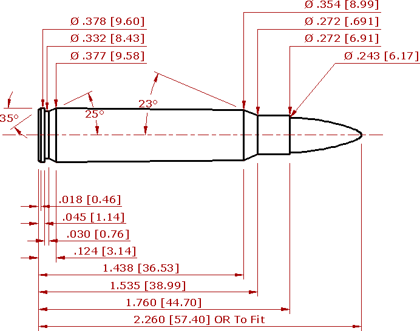

Here is a list of some loads I have used for 6x45mm.

General observations:
* Projectiles much heavier than 95gr are problematic when it comes to seating with the COAL of 2.250". 
* I've found that IMR XBR-8208 grouped the best and QuickLoad tells me it burns better for this particular cartridge.  However BL-C(2) does seem to be easier for me to find.
* I did have to get a seperate seating die for the longer/heavier projecticles as the original one would leave a ring on the projectile itself. 

The [dies are from Redding](https://redding-reloading.com/die_finder/6mm-223-remington-6mm-x-45-conventional-dies/). 

The brass is reformed once-fired .223 brass, either range pickups or donations from friends. I would just run the .223 brass through the 6x45 sizing die to expand the necks.

The 75gr Hornday V-MAX seemed to seat the beast, followed by the 80gr Barnes TTSX. It seems to me that the 80gr Barnes TTSX grouped the best, along with the 75gr Hornady V-MAX. If you're hunting, it's probably better to stick with the Barnes, but if you're plinking or varminting then the Hornady V-MAX is the better bet. The 87gr Berger Hunter seated very poorly - I would not recommend those unless you have a chamber that is cut to accept to longer bullets.

I load these to 2.260" COAL (to fit in a STANAG magazine). All weights are in grains, and velocities in feet-per-second. The velocities were recorded using a 20" barrel.

**Use this load data at your own risk, and stick to the recommended safe handloading practices.**

| Projectile Name | Weight | Powder Name | Weight | Velocity |
|:----------------|------:|:------------|:-------|:---------:|
| Barnes 62gr Varmint Grenade | 62 | BL-C(2) | 26.0 | 2949 |
|                             | 62 |IMR XBR-8208 | 26.4 | 2960 |
| Hornady 75gr V-MAX          |  75 | BL-C(2) | 25.2 | 2680 |
|                             |  75 | BL-C(2) | 27.3 | 2745 |
|                             |  75 | BL-C(2) | 27.4 | 2829 |
|                             |  75 | IMR XBR-8208 | 26.0 | 2909 |
|                             |  75 | BL-C(2) | 27.65 | 2851 |
| Barnes TTSX                 | 80 | BL-C(2) | 26.5 | 2637 |
|                             | 80 | BL-C(2) | 25.2 | 2429 |
|                             | 80 | IMR XBR-8208 | 23.0 | 2472 |
|                             | 80 | IMR XBR-8208 | 27.0 | 2643 |
| Berger Hunter               | 87 | BL-C(2) | 24.2 | 2399 |
| Hornady ELD-X               | 90 | BL-C(2) | 27.2 | 2363 |
| Nosler Partition            | 95 | BL-C(2) | 25.2 | 2330 |
|                             | 95 | BL-C(2) | 26.5 | 2435 |

For the curious, here are the case dimensions for 6x45. Note that this is not a SAAMI approved cartridge - it is a wildcat.

